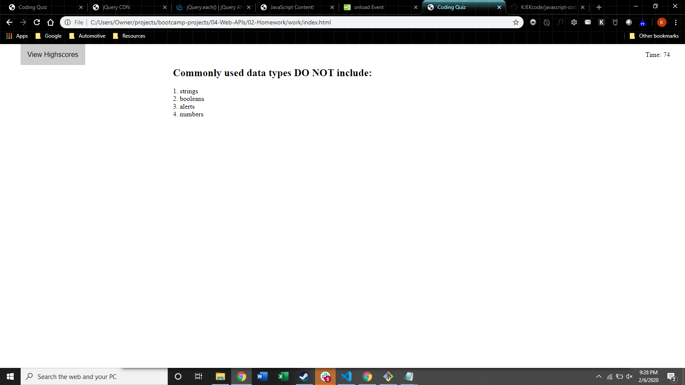

# javascript-coding-quiz
Asks questions and records your answers allowing you to post your high score and save it in local storage

screenshot of final project:

link to live demo:
https://kjekcode.github.io/javascript-coding-quiz/
